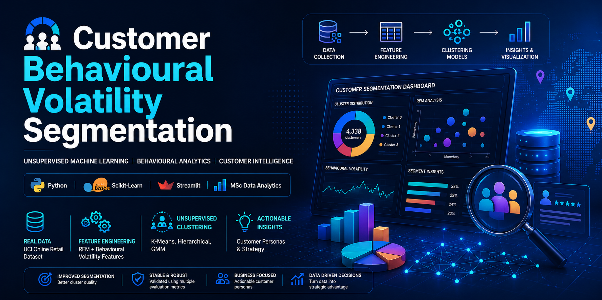
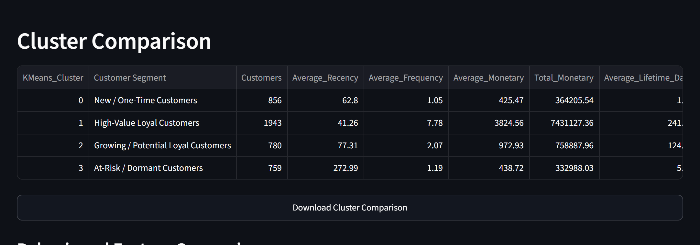
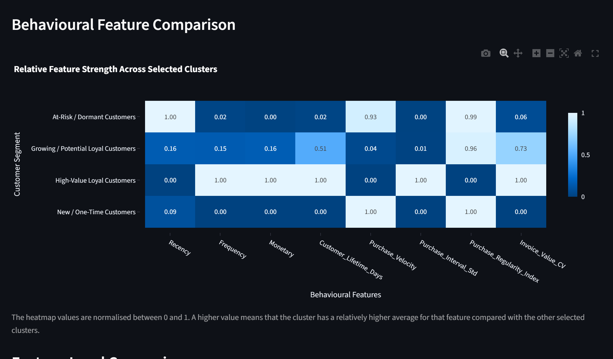
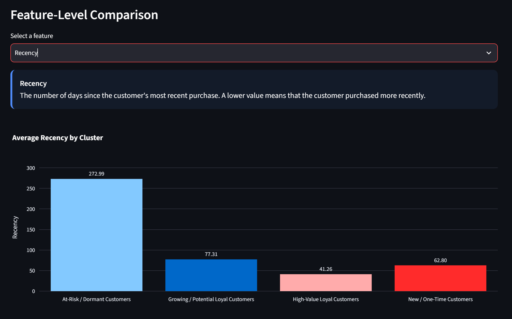
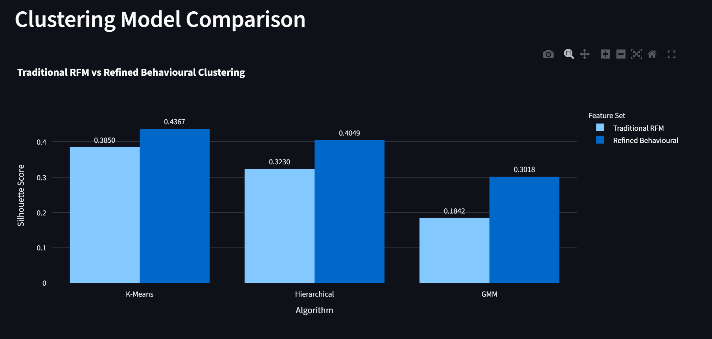
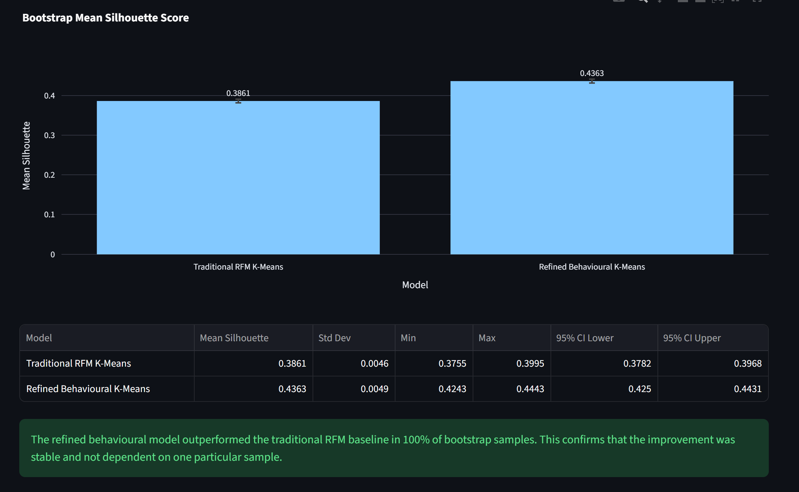

<p align="center">
  
</p>

# Customer Behavioural Volatility Segmentation using Unsupervised Machine Learning


<p align="center">


</p>

---

## Project Overview

Customer segmentation is a fundamental business analytics technique that enables organisations to understand customer behaviour and develop targeted marketing strategies.

Traditional segmentation methods rely heavily on **Recency, Frequency and Monetary (RFM)** features, which often fail to capture behavioural consistency and purchasing variability over time.

This project proposes a **behavioural volatility-based customer segmentation framework** that enriches conventional RFM features with customer behavioural characteristics before applying unsupervised machine learning techniques.

The work was completed as part of the **MSc Data Analytics** programme at the **National College of Ireland**.

---

## Research Objective

The objective of this project is to investigate whether behavioural volatility features improve customer segmentation compared with the traditional RFM representation.

The research focuses on:

- Customer behavioural feature engineering
- Unsupervised customer segmentation
- Cluster quality evaluation
- Customer persona development
- Statistical validation of clustering performance

---

## Dataset

**Dataset:** UCI Online Retail Dataset

The dataset contains transactional records collected from a UK-based online retailer.

**Source**

https://archive.ics.uci.edu/dataset/352/online+retail

After preprocessing:

- 4,338 customers
- Customer-level behavioural features
- Cleaned transactional records

---

# Project Workflow

```text
Raw Online Retail Dataset
            │
            ▼
     Data Understanding
            │
            ▼
       Data Cleaning
            │
            ▼
     RFM Feature Engineering
            │
            ▼
 Behavioural Volatility Features
            │
            ▼
 Advanced Behavioural Features
            │
            ▼
     Feature Selection
            │
            ▼
     Clustering Algorithms
            │
            ▼
        Model Evaluation
            │
            ▼
      Customer Personas
            │
            ▼
 Interactive Dashboard
```
# Dashboard Preview

The project includes an interactive dashboard developed to explore customer behaviour, clustering results and business insights.

## Home Dashboard



---

## Customer Segmentation



---

## Cluster Analysis



---

## Customer Personas



---

## Model Evaluation


---

# Repository Structure

```text
customer-behavioural-volatility-segmentation/

│
├── data/
│
├── notebooks/
│   ├── 01_data_understanding.ipynb
│   ├── 02_data_cleaning.ipynb
│   ├── 03_rfm_features.ipynb
│   ├── 04_volatility_features.ipynb
│   ├── 05_advanced_behavioural_features.ipynb
│   ├── 06_feature_selection.ipynb
│   ├── 07_clustering_models.ipynb
│   ├── 08_evaluation.ipynb
│   ├── 09_visualizations.ipynb
│   └── 10_model_validation.ipynb
│
├── outputs/
│   ├── dashboard/
│   ├── figures/
│   └── tables/
│
├── src/
│
├── app.py
├── run_pipeline.py
├── requirements.txt
└── README.md
```

---

# Technologies Used

- Python
- Pandas
- NumPy
- Scikit-learn
- SciPy
- Matplotlib
- Streamlit
- Jupyter Notebook

---

# Machine Learning Pipeline

## Feature Engineering

Traditional Features

- Recency
- Frequency
- Monetary

Behavioural Features

- Purchase Interval Variability
- Behavioural Volatility
- Customer Consistency
- Advanced Behavioural Indicators

---

## Clustering Models

The following unsupervised learning algorithms were evaluated:

- K-Means Clustering
- Hierarchical Agglomerative Clustering
- Gaussian Mixture Models

---

## Evaluation Metrics

Model performance was evaluated using:

- Silhouette Score
- Davies-Bouldin Index
- Calinski-Harabasz Index
- Bootstrap Stability Analysis
- PCA Visualisation

---

# Key Results

The behavioural volatility representation produced superior customer segmentation compared with the traditional RFM representation.

### Highlights

- Improved clustering quality
- More stable customer segments
- Behaviourally meaningful customer personas
- Better business interpretability

---

# Dashboard

The project includes an interactive **Streamlit Dashboard** for exploring customer segmentation results.

Launch the dashboard using:

```bash
streamlit run app.py
```

---

# Installation

Clone the repository

```bash
git clone https://github.com/puntambekartushar8899/customer-behavioural-volatility-segmentation.git
```

Navigate to the project

```bash
cd customer-behavioural-volatility-segmentation
```

Install dependencies

```bash
pip install -r requirements.txt
```

Execute the pipeline

```bash
python run_pipeline.py
```

Launch the dashboard

```bash
streamlit run app.py
```

---

# Outputs

The project generates:

- Cleaned customer datasets
- Behavioural feature datasets
- Cluster assignments
- Customer personas
- Evaluation metrics
- Interactive dashboard
- Publication-quality visualisations

---

# Future Improvements

Potential future enhancements include:

- Deep clustering techniques
- Autoencoder-based feature learning
- Real-time customer segmentation
- Explainable AI (XAI)
- Customer Lifetime Value (CLV) integration

---

# Author

**Tushar Naresh Puntambekar**

MSc Data Analytics  
National College of Ireland

GitHub:
https://github.com/puntambekartushar8899


## Project Highlights

- Developed an end-to-end customer segmentation pipeline in Python.
- Engineered behavioural volatility features to enhance traditional RFM analysis.
- Compared K-Means, Hierarchical Agglomerative Clustering, and Gaussian Mixture Models.
- Evaluated clustering quality using Silhouette, Davies–Bouldin, and Calinski–Harabasz indices.
- Built an interactive Streamlit dashboard for business insights and visualization.
---

# Citation

If you use this repository in academic work, please cite the accompanying MSc dissertation.

---

# License

This repository is released under the MIT License.